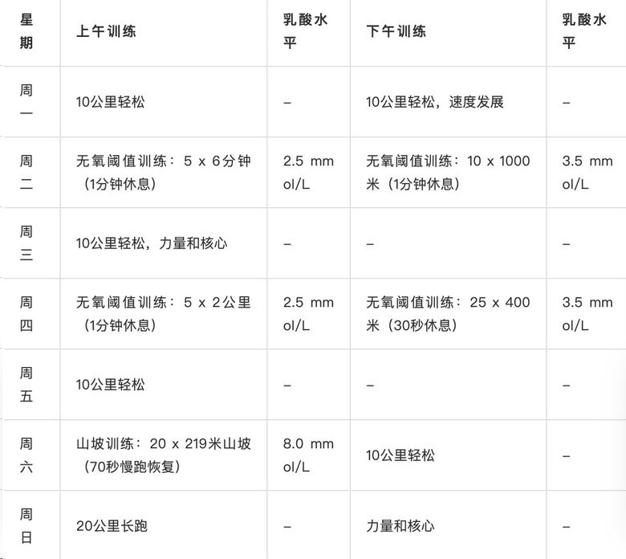

# Double-threshold-training
Norwegian elite long-distance runner double threshold training method

##  参考

雅各布的基础训练期由四个不同的部分组成：轻松跑、阈值训练、山地训练和长跑。

雅各布日常训练以轻松跑为基础，这是 Ingebrigtsen 训练方案中最重要的部分。

每周一、周三和周五，他都会进行两次 10 公里的轻松跑。尽管建议他保持每公里约 4 分钟的速度，但雅各布常常会以更快的速度完成训练，大约每公里 3 分 45-50 秒。

每周二和周四，他都会进行两次“双阈值”训练，作为 Ingebrigtsen 训练的一部分。

通常，早上的训练时间较长，乳酸水平较低（<2mmol），而晚上的训练时间较短，乳酸水平略高（< 3.5mmol）。

雅各布会努力控制这些训练的强度，不断监测乳酸水平，偶尔也会选择跑步机锻炼。

周六，雅各布会进行高强度的山地训练。他们要完成 20 ✖ 200 米山地重复训练，然后下坡慢跑约一分钟作为恢复。

Ingebrigtsen 的这项高强度训练将他们的乳酸水平提高到 8-10mmol，是一周中最具挑战性的训练。通常，他们会在晚上进行强度较低的阈值训练。

周日是留给长跑的，这是 Ingebrigtsen 训练世界的重要组成部分。

+ 一周典型计划

日期	上午训练内容	下午训练内容
周一	轻松跑10公里，配速每公里3分45-50秒	轻松跑10公里，速度相同
周二	5组6分钟跑步，乳酸水平低于2mmol	10-12组1000米跑步，乳酸水平低于3.5mmol
周三	轻松跑10公里，配速每公里3分45-50秒	轻松跑10公里，速度相同
周四	6组5分钟跑步，乳酸水平低于2mmol	20组400米跑步，乳酸水平低于3.5mmol
周五	轻松跑10公里，配速每公里3分45-50秒	轻松跑10公里，速度相同
周六	20组200米爬坡训练，乳酸水平提高至8-10mmol	较轻松的阈值训练，乳酸水平降至2mmol以下
周日	20公里长跑，配速每公里3分45-50秒	20公里长跑，配速每公里3分45-50秒

--------------------------------------------------------------------

**双阈值法介绍**

+ 概念：
    + 双阈值训练法是一种结合有氧和无氧训练的策略，旨在通过不同的训练强度来提高运动员的耐力和速度。
    + 这种方法特别强调在训练中同时发展有氧耐力和无氧能力，通过在训练中设置两个关键的阈值（即有氧阈值和无氧阈值）来实现。

+ 训练强度区域：
    + 有氧阈值：通常指的是运动员在进行有氧训练时，血乳酸水平开始显著上升的点。在这个阈值以下，训练主要是有氧的。
    + 无氧阈值：指的是血乳酸水平迅速上升，进入无氧代谢状态的点。在这个阈值以上，训练主要是无氧的。

+ 训练安排：
    + 有氧训练：在有氧阈值以下进行，目的是提高心肺功能和耐力，通常以较低的强度和较长的时间进行。
    + 无氧训练：在无氧阈值以上进行，目的是提高无氧耐力和速度，通常以较高的强度和较短的时间进行。

+ 训练实例：
    + 有氧训练：轻松跑、长距离慢跑等。
    + 无氧训练：高强度的短跑、间歇跑、山坡跑等。

+ 训练周期：
    + 基础阶段：主要进行有氧训练，建立基础耐力。
    + 专项阶段：增加无氧训练的比例，提高比赛配速和无氧耐力。
    + 比赛阶段：根据比赛需求调整训练强度和内容。

----------------------------------------------------------------------------

## 分析

**强度跑：高乳酸阈值跑（保证强度刺激）+ 一般间歇（长短交替（短变速），固定距离跑，区别于重复跑）+ 一次高强度的阈值跑训练+周末一次长距离**

**训练体现两极化特点** 

中距离项目首先需要运动员要有极强的耐力，因为基础耐力好才能更有效的清除和代谢乳酸；其次，还要多进行大强度的速度训练，这样才能提升速度和维持速度的能力，所以既需要高强度无氧训练又需要低强度有氧训练。

研究发现，这些世界级高水平运动员在进行耐力训练时，通常采用低于乳酸阈的强度（约占总训练时间或训练总距离的75%），或明显高于乳酸阈的强度（约15-20%），而很少采用乳酸阈强度（约5%）。**他们认为，对于训练有素的运动员来说，过多的达到乳酸阈强度的训练可能会产生交感神经过度负荷，同时在获得能力上并不是最佳的刺激。高水平耐力运动员的训练应以低强度和多样化的训练为主，同时配合以少量的高强度训练，这样可能会确保对相关基因的高度诱导，同时还能减少对机体的刺激压力**。

1、训练总量不足

**由于高比例的中大强度无氧训练提高了训练的平均强度，由此导致训练总量，也即跑量的减少**。忽视有氧训练的直接后果是对跑者耐力基础的影响，机体运动时氧的储备、运输和利用系统均会由于有氧训练量的不足而无法得到有效发展，鉴于有氧是无氧耐力的基础，所以当有氧能力这一决定运动员耐力水平的基础能力没有得到应用的重视和发展时，影响的就不仅仅是有氧能力本身，而且也制约了无氧能力的提高。

2. 不利于基础耐力的发展

**高强度训练对跑者的机体会产生很大刺激，而这种刺激有时是对身体有害的**。我国科研人员发现，运动员在75%最大摄氧量强度长时间运动时，红细胞粘滞性增强，可能导致微循环障碍，毛细血管血流速度减慢，供血供氧不足，进而影响到人体能量的供应，降低有氧运动能力。对于大众跑者来说，**大量的中高速无氧训练，会加重机体各器官系统的工作负荷，延长恢复时间，加之缺乏有氧基础的支持，如果运用不当很容易造成过度训练和损伤**。

3. 慢不下来、快不上去 

**高的平均强度非但没有提高中长跑专项耐力，反而破坏了训练节奏，如果训练负荷总是徘徊在85%-90%左右的次最大负荷区间，既不能有效发展有氧能力，也无法保证最大强度训练的质量**。同时，**频繁的高强度刺激使跑者长期处于疲劳状态并得不到恢复**，跑者在训练和比赛中缺乏“兴奋点”，经常表现出“慢不下来快不上去”的现象。

----------------------------------------------

## 训练计划

> 有氧低强度跑占绝大部分+比赛是甚至低强度跑比例更高

**强度跑：高乳酸阈值跑（保证强度刺激）+ 一般间歇（长短交替（短变速），固定距离跑，区别于重复跑）+ 一次高强度的阈值跑训练+周末一次长距离**

**训练特点**
+ 高周训练量：每周训练量在120到180公里之间。
+ 低强度训练为主：大约70-80%的训练量在低强度区域完成，即心率在最大心率的62-82%之间，乳酸浓度在0-2.0 mmol/L。
+ 无氧阈值训练：高强度训练主要围绕无氧阈值进行，心率在最大心率的82-92%之间，乳酸浓度在2-4 mmol/L。
+ 间隔训练：这些高强度训练通常以间隔形式进行，每周2-4次，有时在同一天进行两次训练（称为“双阈值日”）。
+ 监控训练强度：使用乳酸测量和心率监测来确保训练强度适当，防止过度训练。
+ 短间歇和冲刺训练：每周进行1-2次更高强度的训练，包括短间隔（超过800米）和短冲刺。
+ 避免长时间有氧能力间隔训练：在基础训练期间，通常不进行强烈、长时间的有氧能力间隔训练（心率在最大心率的92-97%之间，乳酸浓度在4.0-8.0 mmol/L）。
+ 比赛前的训练调整：**在比赛前6-10周开始进行比赛特定的较长间隔训练，以比赛速度和无氧能力的培养为主**，同时减少接近无氧阈值的训练课程数量。 

*日期表示三选二或者休息二选一

日期	上午训练内容	                           下午训练内容
周一*	轻松跑6-10公里，配速每公里355-415秒*	  轻松跑10公里，速度相同

周二*	轻松跑6-10公里，配速每公里415-435秒*      5-8组6分钟跑步，330-340略快于节奏 or 10-12组1000米/8-10组1200米/8组1600米/5-6组2000米/2-3组4000米（视备赛目的而定）跑步

周三*	轻松跑6-10公里，配速每公里355-415秒*	  轻松跑10公里，速度相同

周四（休息*） 轻松跑6-10公里，配速每公里415-435秒* 	（视备赛目的而定）节奏跑 8-12km or 200/300速度训练（一个长的之后再跑短的）

周五（休息*）	轻松跑6-10公里，配速每公里355-415秒*	44221km/43211km间歇  or 轻松跑10公里，速度相同 （可与周二调换）   

周六	轻松跑6-10公里，配速每公里415-435秒*	变速跑20-30组300

周日	轻松跑6-10公里，配速每公里415-435秒*   16-20公里长距离	

<!-- 
44221/43211

变速

200/300速度训练

节奏跑/长距离

长短结合训练 -->

